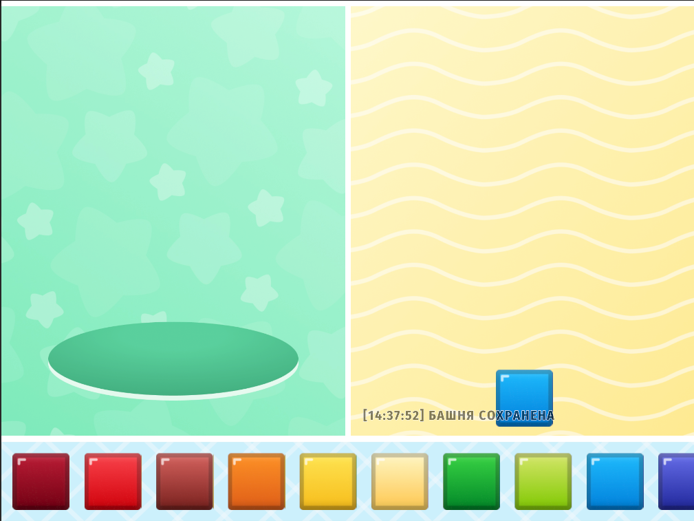
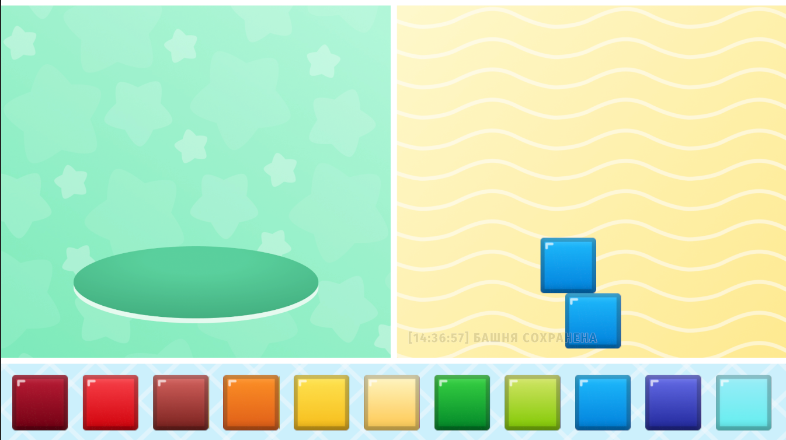
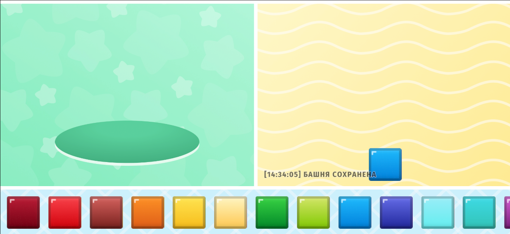
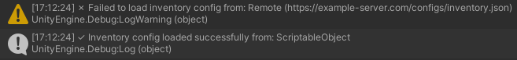
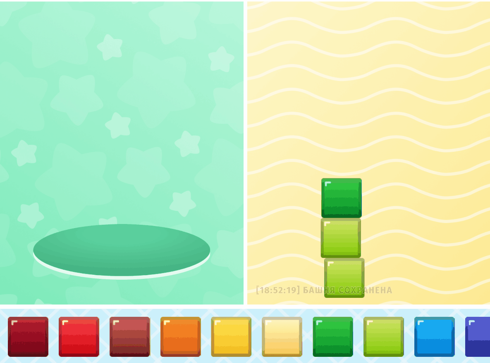

# 🎮 Тестовое задание

## 📝 Введение

Представляю тестовое задание, разработанное для **JUSTMOBY**. 

**Время разработки:** 20-28 часов (5-7 часов в день на протяжении 4 дней)

**Используемые технологии:**
- 🏗️ **VContainer** - Dependency Injection
- 🎬 **DOTween** - Анимации
- ⚡ **UniTask** - Асинхронные операции для загрузки конфигураций
- 🔧 **Odin Inspector** 
- 📋 **vHierarchy** - Улучшенная навигация по иерархии

---

## 🎨 Подготовка и дизайн

### 📋 Структура Canvas

UI разработан с учетом предоставленного референса и дополнительной работы в Figma для создания маски отверстия и спрайт-листа кубиков (исключая половинчатые пиксели).

**Результат адаптации под различные соотношения сторон:**

| Соотношение 4:3 | Соотношение 16:9 | Соотношение 19.5:9 |
|:---:|:---:|:---:|
|  |  |  |

### 🏗️ Архитектура UI

```
🖥️ UI_Canvas_Main                              📐 Scale With Screen Size
├── 📦 UI_Container_Top
│   ├── 🗑️ UI_Panel_Hole                       ⭐ Зона удаления кубиков
│   │   ├── 🖼️ UI_Image_Hole_Background
│   │   ├── 🕳️ UI_Image_Hole
│   │   ├── 🎭 UI_Mask_Falling
│   │   └── 🎯 UI_DropZone_Hole                🔥 Drop-зона для удаления
│   └── 🏗️ UI_Panel_TowerBuilding              ⭐ Зона строительства башни
│       ├── 🖼️ UI_Image_Tower_Background
│       └── 🎯📦 UI_DropZone_Container_Tower  🔥 Drop-зона башни/контейнера кубиков
├── 🎒 UI_Panel_Inventory                      ⭐ Основная панель инвентаря
│   ├── 🖼️ UI_Image_Inventory_Background
│   └── 📜 UI_ScrollView_Cubes                 💡 Скроллинг кубиков
│       └── 👁️ UI_Viewport_Cubes
│           └── 📦 UI_Container_Cubes          🔥 Контейнер для кубиков
├── ✋ UI_Container_Drag                       💡 Контейнер перетаскивания
│   └── 👻 UI_Cube_Ghost                       💡 Призрачный кубик
├── 📝 UI_Container_Logger                     💡 Система логирования
│   └── 📄 UI_Text_GameLog                     💡 Текстовые сообщения
└── ✨ UI_Container_Effects                    💡 Визуальные эффекты
```

---

## 🎮 Game Flow

### Механика взаимодействия с кубиками:

**Из инвентаря (UI_Container_Cubes):**
- ❌ **Некорректная зона (UI_Panel_Hole)** → Эффект исчезновения кубика
- ❌ **Зона башни ниже верхнего кубика** → Эффект падения вниз
- ❌ **Большое смещение от верхнего кубика** → Эффект падения с горизонтальным смещением
- ✅ **Корректное размещение в зоне башни** → Эффект установки кубика

**Из башни (UI_DropZone_Container_Tower):**
- ❌ **Некорректная зона** → Эффект исчезновения кубика
- ✅ **Зона удаления (овальная область)** → Эффект падения в дыру + гравитация для остальных кубиков

**Дополнительные особенности:**
- 💾 **Автосохранение** между сессиями контейнера кубиков башни
- 📝 **Система логирования** всех действий игрока в UI_Text_GameLog
- 🧪 **Режим тестирования** с фиксированным позиционированием (вместо случайного offset)

---

## 🏗️ Архитектура проекта

### 📁 Структура файлов

```
T3UnityKidsProject/
├── 📂 Assets/
│   ├── 🎮 Scripts/                    # Основной код проекта
│   │   ├── 🧠 Core/                   # ⭐ Ядро системы - интерфейсы и модели
│   │   ├── ⚙️ Infrastructure/         # 🔧 Реализации и сервисы
│   │   ├── 🎛️ Configuration/          # 📋 Система конфигураций
│   │   ├── 🖼️ Presentation/           # 🎨 UI и визуальные компоненты
│   │   └── 🔌 Installers/             # 💉 Dependency Injection
│   │
│   ├── 🎬 Scenes/                     # Игровые сцены
│   ├── 🎯 Prefabs/                    # Unity префабы
│   ├── 🖼️ Sprites/                    # Графические ресурсы
│   ├── 🔤 Fonts/                      # Шрифты
│   ├── 📦 Resources/                  # Unity Resources
│   ├── 🔧 Settings/                   # Настройки проекта
│   └── 🔌 Plugins/                    # Внешние библиотеки
│
└── 📄 StreamingAssets/               # 🌐 JSON конфигурации для runtime
```

### 🧠 Core Layer - *Чистая архитектура*

```
Core/
├── 🔌 Interfaces/
│   ├── Services/                     
│   │   ├── IGameConfigService.cs     # 🎮 Игровые настройки
│   │   ├── IInventoryConfigService.cs # 🎒 Конфигурация инвентаря
│   │   ├── ILocalizationConfigService.cs # 🌍 Мультиязычность
│   │   ├── IAnimationsConfigService.cs # 🎬 Анимации
│   │   ├── ILoggerService.cs         # 📝 Логирование
│   │   ├── ICubeDataContainer.cs     # 📊 Данные кубов
│   │   ├── IDragService.cs           # 🖱️ Перетаскивание
│   │   ├── IEffectsService.cs        # ✨ Эффекты
│   │   ├── ISaveService.cs           # 💾 Сохранения
│   │   └── ICubeFactory.cs           # 🏭 Фабрика кубов
│   │
│   └── ConfigSources/                # 📡 Источники конфигураций
│       ├── IGameConfigSource.cs      # 🎮 Источники игровых настроек
│       ├── IInventoryConfigSource.cs # 🎒 Источники инвентаря
│       └── ILocalizationConfigSource.cs # 🌍 Источники переводов
│
└── 📊 Models/                        # 🎯 Чистые модели данных
    ├── CubeColor.cs                  # 🎨 Перечисление цветов
    ├── Language.cs                   # 🌍 Языки
    ├── ValidationResult.cs           # ✅ Результат валидации
    ├── SaveData.cs                   # 💾 Данные сохранения
    ├── EffectDirection.cs            # 🧭 Направления эффектов
    │
    └── ConfigData/                   # 📋 DTO конфигурации
        ├── GameConfigData.cs         # 🎮 Игровые данные
        ├── InventoryConfigData.cs    # 🎒 Данные инвентаря
        ├── LocalizationConfigData.cs # 🌍 Данные локализации
        └── AnimationsConfigData.cs   # 🎬 Данные анимаций
```

### ⚙️ Infrastructure Layer - *Реализации и сервисы*

```
Infrastructure/
├── 🔧 Services/
│   ├── Core/                         # 🎯 Базовые сервисы
│   │   ├── LoggerService.cs          # 📝 Система логирования
│   │   ├── SaveService.cs            # 💾 Сохранение/загрузка
│   │   ├── AutoSaveService.cs        # 🔄 Автосохранение
│   │   └── CubeDataContainer.cs      # 📊 Контейнер данных кубов
│   │
│   ├── Game/                         # 🎮 Игровая логика
│   │   ├── TowerService.cs           # 🏗️ Управление башней
│   │   ├── DragService.cs            # 🖱️ Система перетаскивания
│   │   ├── EffectsService.cs         # ✨ Система эффектов
│   │   └── CubeFactory.cs            # 🏭 Фабрика создания кубов
│   │
│   └── Config/                       # 📋 Сервисы конфигураций
│       ├── GameConfigService.cs      # 🎮 Multi-Source конфигурация игры
│       ├── InventoryConfigService.cs # 🎒 Multi-Source конфигурация инвентаря
│       ├── LocalizationConfigService.cs # 🌍 Multi-Source локализация
│       └── LocalizationService.cs    # 🔤 Основной сервис переводов
│
├── 📡 ConfigSources/                 # 🎯 Стратегии загрузки конфигураций
│   ├── ScriptableObject/             # 📋 Unity ScriptableObject источники
│   │   ├── ScriptableObjectGameConfigSource.cs
│   │   ├── ScriptableObjectInventoryConfigSource.cs
│   │   └── ScriptableObjectLocalizationConfigSource.cs
│   │
│   ├── Json/                         # 📄 JSON файлы
│   │   ├── JsonFileGameConfigSource.cs
│   │   ├── JsonFileInventoryConfigSource.cs
│   │   └── JsonFileLocalizationConfigSource.cs
│   │
│   └── Remote/                       # 🌐 Удалённые источники
│       ├── RemoteGameConfigSource.cs
│       ├── RemoteInventoryConfigSource.cs
│       └── WebLocalizationConfigSource.cs
│
├── 📊 Models/                        # 🎯 Unity-специфичные модели
│   ├── TranslationsData.cs           # 🌍 Структуры переводов
│   ├── CubeColorSpriteData.cs        # 🎨 Связка цвет-спрайт
│   │
│   └── GameData/                     # 🎮 Игровые структуры
│       ├── CubeData.cs               # 🧩 Данные куба
│       └── TowerData.cs              # 🏗️ Данные башни
│
└── ✅ Validators/                    # 🎯 Система валидации
    ├── CubeOffsetValidator.cs        # 📏 Валидация смещения
    ├── CubeHeightValidator.cs        # 📐 Валидация высоты
    └── CompositeCubeValidator.cs     # 🔗 Композитный валидатор
```

### 🎛️ Configuration Layer - *Система конфигураций*

```
Configuration/
├── 📋 ScriptableObjects/             # 🎯 Unity конфигурации
│   ├── GameConfig.cs                 # 🎮 Основные настройки игры
│   ├── InventoryConfig.cs            # 🎒 Настройки инвентаря
│   ├── LocalizationConfig.cs         # 🌍 Переводы
│   └── AnimationsConfig.cs           # 🎬 Настройки анимаций
│
└── 📁 Assets/                        # 🎯 .asset файлы для инспектора
    ├── GameConfig.asset              # 🎮 Экземпляр игровой конфигурации
    ├── InventoryConfig.asset         # 🎒 Экземпляр конфигурации инвентаря
    ├── LocalizationConfig.asset      # 🌍 Экземпляр переводов
    └── AnimationsConfig.asset        # 🎬 Экземпляр анимаций
```

### 🖼️ Presentation Layer - *UI и визуализация*

```
Presentation/
└── 🎨 Views/                         # 🎯 UI компоненты
    ├── InventoryView.cs              # 🎒 Отображение инвентаря
    ├── TowerView.cs                  # 🏗️ Отображение башни
    ├── LoggerView.cs                 # 📝 UI логгера
    ├── TowerCubeView.cs              # 🧩 Куб в башне
    ├── InventoryCubeView.cs          # 🧩 Куб в инвентаре
    ├── GhostCubeView.cs              # 👻 Призрачный куб при перетаскивании
    ├── CubeEffect.cs                 # ✨ Визуальные эффекты кубов
    └── ApplicationLifecycleNotifier.cs # 🔄 Уведомления жизненного цикла
```

### 🔌 Installers Layer - *Dependency Injection*

```
Installers/
├── ProjectLifetimeScope.cs           # 🌍 Глобальные зависимости
└── GameLifetimeScope.cs              # 🎮 Игровые зависимости
```

---

## ✅ Выполнение технических требований

### 1. 🔧 Расширяемость архитектуры

Код предусматривает легкое расширение функциональности. Реализована **композитная система валидации**, позволяющая добавлять новые правила без модификации существующего кода:

```csharp
// Интерфейс валидатора
public interface ICubeValidator
{
    ValidationResult ValidatePlacement(float localX, float localY, 
        CubeColor color, Vector2 screenPosition);
}

// Результат валидации с направлением эффекта
public struct ValidationResult
{
    public bool IsValid { get; }
    public EffectDirection? EffectDirection { get; }

    public static ValidationResult Valid(EffectDirection? effectDirection = null) 
        => new ValidationResult(true, effectDirection);
    
    public static ValidationResult Invalid(EffectDirection? effectDirection = null) 
        => new ValidationResult(false, effectDirection);
}

// Композитный валидатор для объединения правил
public class CompositeCubeValidator : ICubeValidator
{
    private readonly List<ICubeValidator> _validators = new();

    public void AddValidator(ICubeValidator validator) => _validators.Add(validator);
    public void RemoveValidator(ICubeValidator validator) => _validators.Remove(validator);

    public ValidationResult ValidatePlacement(float localX, float localY, 
        CubeColor color, Vector2 screenPosition)
    {
        foreach (var validator in _validators)
        {
            var result = validator.ValidatePlacement(localX, localY, color, screenPosition);
            if (!result.IsValid) return result;
        }
        return ValidationResult.Valid();
    }
}

// Использование - легко добавлять новые валидаторы
_cubeValidator = new CompositeCubeValidator();
_cubeValidator.AddValidator(new CubeOffsetValidator(cubeDataContainer, gameConfig, 
    towerAreaRect, loggerService));
_cubeValidator.AddValidator(new CubeHeightValidator(cubeDataContainer, 
    gameConfig, loggerService));
```

### 2. 🌍 Система локализации

Полностью реализованная система локализации с взаимодействием через `LoggerService`:

```csharp
public class LocalizationService : ILocalizationService
{
    private Language _currentLanguage = Language.Russian;
    private Dictionary<string, string> _currentTranslations;
    private readonly ILocalizationConfigService _configService;

    public LocalizationService(ILocalizationConfigService configService)
    {
        _configService = configService;
        _configService.OnConfigUpdated += UpdateCurrentTranslations;
    }

    public string GetText(string key)
    {
        if (string.IsNullOrEmpty(key)) return key;
        
        if (_currentTranslations?.TryGetValue(key, out var translation) == true)
            return !string.IsNullOrEmpty(translation) ? translation : key;
        
        Debug.LogWarning($"Translation not found for key: '{key}', language: {_currentLanguage}");
        return key;
    }

    public void SetLanguage(Language language)
    {
        if (_currentLanguage != language)
        {
            _currentLanguage = language;
            UpdateCurrentTranslations();
            OnLanguageChanged?.Invoke();
        }
    }
}
```

### 3. 📡 Мульти-Source система конфигураций

Система поддерживает загрузку конфигураций из различных источников с приоритетностью:



```csharp
// Модель данных
[Serializable]
public class InventoryConfigData
{
    public CubeColor[] availableCubeColors;

    public bool IsValid() => availableCubeColors != null && 
        availableCubeColors.Length > 0 &&
        availableCubeColors.Length == availableCubeColors.Distinct().Count();
}

// Источник данных
public class ScriptableObjectInventoryConfigSource : IInventoryConfigSource
{
    private readonly InventoryConfig _scriptableObject;
    public string SourceName => "ScriptableObject";

    public UniTask<(bool success, InventoryConfigData data)> LoadAsync()
    {
        if (_scriptableObject == null)
            return UniTask.FromResult((false, (InventoryConfigData)null));

        var data = new InventoryConfigData 
        { 
            availableCubeColors = _scriptableObject.availableCubeColors 
        };
        return UniTask.FromResult((data.IsValid(), data));
    }
}

// Сервис с приоритетностью источников
public class InventoryConfigService : IInventoryConfigService
{
    private async UniTask LoadConfigAsync(IInventoryConfigSource[] sources)
    {
        foreach (var source in sources)
        {
            try
            {
                var (success, data) = await source.LoadAsync();
                if (success && data != null)
                {
                    _config = data;
                    Debug.Log($"✓ Config loaded from: {source.SourceName}");
                    OnConfigUpdated?.Invoke();
                    return;
                }
            }
            catch (Exception ex)
            {
                Debug.LogError($"✗ Failed to load from {source.SourceName}: {ex.Message}");
            }
        }
    }
}
```

### 4. 🖱️ Drag & Drop с поддержкой скролла

Интеллектуальная система определения типа жеста - скролл или перетаскивание:

```csharp
private void DetermineDragDirection(PointerEventData eventData)
{
    Vector2 dragDelta = eventData.position - _startDragPosition;
    
    if (dragDelta.magnitude <= DIRECTION_THRESHOLD)
        return;
        
    if (IsHorizontalMovement(dragDelta))
        EnableScrollMode(eventData);
    else
        EnableDragMode();
}

private bool IsHorizontalMovement(Vector2 dragDelta)
{
    float horizontalRatio = Mathf.Abs(dragDelta.x) / dragDelta.magnitude;
    float verticalRatio = Mathf.Abs(dragDelta.y) / dragDelta.magnitude;
    
    return horizontalRatio > verticalRatio;
}
```

### 5. 📱 Адаптивный UI

UI протестирован и адаптирован для всех мобильных соотношений сторон - используется `Scale With Screen Size` для корректного отображения на различных устройствах.

### 6. 🎬 Система анимаций

Полный набор анимаций с использованием **DOTween**:



- ✨ **Эффекты падения** в дыру
- 🎯 **Анимации гравитации** и установки кубиков
- 💨 **Эффекты исчезновения** при неправильном размещении
- 📝 **Анимация текста** логов
- 🧪 **Режим ManualPlacement** для точного позиционирования (настраивается в GameConfig)

Реализации:
- `CubeEffect.cs` - анимации смещения и исчезновения
- `TowerCubeView.cs` - анимации гравитации
- `LoggerView.cs` - анимации текстовых уведомлений

### 7. 💾 Система сохранений

Автоматическое сохранение состояния игры:

```csharp
// Триггеры сохранения
ApplicationLifecycleNotifier.cs  // Отслеживание выхода/потери фокуса
AutoSaveService.cs              // Автоматическое сохранение
SaveService.cs                  // Основная логика сохранения/загрузки
```

---

